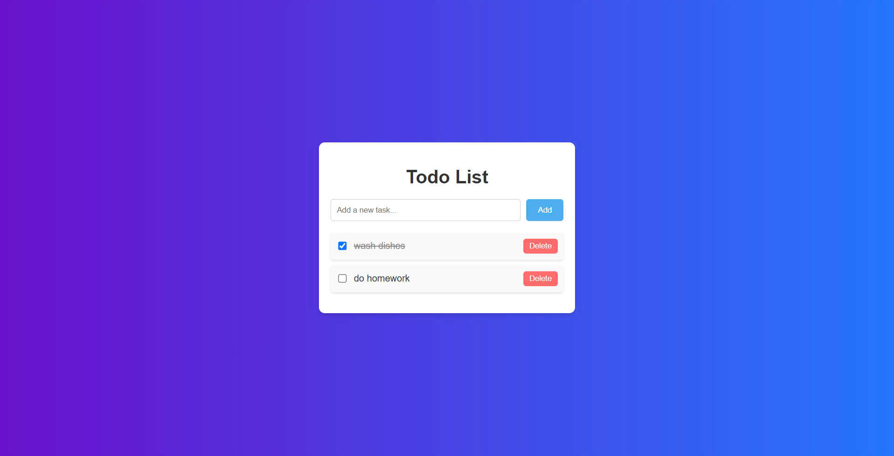

# Todo List Web App 📝

This is a simple and interactive Todo List web application that allows users to manage their daily tasks efficiently. The app features a clean and modern design with a gradient background and responsive elements.

## Features
- **Add New Tasks**: Quickly add tasks to your list.
- **Mark Tasks as Completed**: Check off tasks when they are done.
- **Delete Tasks**: Remove tasks from the list when no longer needed.
- **Responsive Design**: Works seamlessly on different screen sizes.

## Technologies Used
- **HTML**: For the structure of the application.
- **CSS**: For styling and layout.
- **JavaScript**: For interactivity and functionality.

## Installation & Usage
1. Clone the repository:
    ```bash
    git clone https://github.com/yourusername/todo-list.git
    ```
2. Navigate to the project directory:
    ```bash
    cd todo-list
    ```
3. Open `index.html` in your web browser:
    - Double-click the `index.html` file, or
    - Use a live server (e.g., the Live Server extension in VS Code).

4. Start adding tasks and managing your to-do list!

## Screenshot
### Main Interface


## Folder Structure
```
Todo_List/
├── css/
│   └── styles.css       # Styling for the application
├── index.html           # Main HTML file
├── index.js             # JavaScript for functionality
├── README.md            # Project documentation
└── todo.jpg             # screenshot
```

## Contributing
Contributions are welcome! Feel free to fork the repository and submit a pull request.

## License
This project is created for educational purpose.
